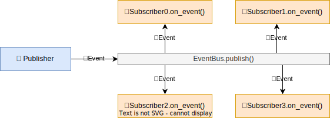

# pubsub-bus


Thread-safe one-to-many event system. Simple and easy to use. It just works (hopefully).

- [pubsub-bus](#pubsub-bus)
    - [Whaty it does (Without words)](#whaty-it-does-without-words)
    - [Quick Start](#quick-start)
        - [1. Add the dependency to your `Cargo.toml`](#1-add-the-dependency-to-your-cargotoml)
        - [2. Create your events and a bus](#2-create-your-events-and-a-bus)
        - [3. Implement the Subscriber trait for your struct and subscribe it to the bus](#3-implement-the-subscriber-trait-for-your-struct-and-subscribe-it-to-the-bus)
        - [4. Create a Publisher and pass the bus to it](#4-create-a-publisher-and-pass-the-bus-to-it)
        - [5. Send events](#5-send-events)
    - [Examples](#examples)

## Whaty it does (Without words)



## Quick Start

### 1. Add the dependency to your `Cargo.toml`

```toml
pubsub-bus = "1.0.0"
```

### 2. Create your events and a bus

```rust
pub enum Commands {
    Atack { player_id: u32 },
    Move { player_id: u32, x: f32, y: f32 },
}

let mut bus: Shared<EventBus<Commands>> = EventBus::new().into_shared();
```

### 3. Implement the Subscriber trait for your struct and subscribe it to the bus

```rust
impl Subscriber<Commands> for Player {
    fn on_event(&mut self, event: &Event<Commands>) {
        // Handle the event
    }
}

...

let player = Player { id: 1 }.into_shared();
bus.with(|b| {
    b.subscribe(player);
});
```

### 4. Create a Publisher and pass the bus to it

```rust
pub struct Input {
    publisher: Publisher<Commands>,
}

impl Input {
    pub fn new(bus: Shared<EventBus<Commands>>) -> Self {
        Self {
            publisher: Publisher::new(bus),
        }
    }
    ...
}
```

### 5. Send events

```rust
impl Input {
    pub fn send_move(&self, player_id: u32, x: f32, y: f32) {
        self.publisher.publish(Event::new(Commands::Move { player_id, x, y }));
    }
}
```

## Examples

The following example demonstrates how to exchange events between players and an input system.

```rust
fn main() {
    // Create a bus
    let bus = EventBus::new().into_shared();

    // Create players and subscribe them to the bus
    let player1 = Player { id: 1 }.into_shared();
    let player2 = Player { id: 2 }.into_shared();
    bus.with(|b| {
        b.subscribe(player1);
        b.subscribe(player2)
    });

    // Create an input and connect it to the bus
    let input = Input::new(bus.clone());

    // Send some events
    input.send_move(1, 1.0, 2.0);
    input.send_atack(2);
}
```

For the full example, see the [examples/basic_game_events](examples/basic_game_events) directory.

