# pubsub-bus

[](https://github.com/an-dr/pubsub-bus/releases)

Thread-safe one-to-many event system. Simple and easy to use. It just works (hopefully).

- [pubsub-bus](#pubsub-bus)
    - [⚙️ What it does (Without words)](#️-what-it-does-without-words)
    - [🚀 Quick Start](#-quick-start)
        - [1. Add the dependency to your `Cargo.toml`](#1-add-the-dependency-to-your-cargotoml)
        - [2. Create your events and a bus](#2-create-your-events-and-a-bus)
        - [3. Implement the Subscriber trait for your struct and subscribe it to the bus](#3-implement-the-subscriber-trait-for-your-struct-and-subscribe-it-to-the-bus)
        - [4. Create a Publisher and pass the bus to it](#4-create-a-publisher-and-pass-the-bus-to-it)
        - [5. Send events](#5-send-events)
    - [📖 Examples](#-examples)

## ⚙️ What it does (Without words)



## 🚀 Quick Start

### 1. Add the dependency to your `Cargo.toml`

```toml
pubsub-bus = "3.0.0"
```

### 2. Create your events and a bus

```rust
enum Commands {
    Atack { player_id: u32 },
    Move { player_id: u32, x: f32, y: f32 },
}

#[derive(PartialEq)]
enum TopicIds {
    Player1,
    Player2,
}


let bus: EventBus<Commands, TopicIds> = EventBus::new();
```

### 3. Implement the Subscriber trait for your struct and subscribe it to the bus

```rust
impl Subscriber<Commands, TopicIds> for Player {
    fn on_event(&mut self, event: &BusEvent<Commands, TopicIds>) {
        let event_id = event.get_id();
        let event_source_id = event.get_source_id();
        match event.get_content() {
         ...
        }
    }
}

...

let player1 = Player { id: 1 };
bus.add_subscriber(player1);
```

### 4. Create a Publisher and pass the bus to it

```rust
pub struct Input {
    emitter: EventEmitter<Commands, TopicIds>,
}

impl Publisher<Commands, TopicIds> for Input {
    fn get_mut_emitter(&mut self) -> &mut EventEmitter<Commands, TopicIds> {
        &mut self.emitter
    }
}

...

let mut  input = Input::new();
bus.add_publisher(&mut input);

```

### 5. Send events

```rust
impl Input {
    pub fn send_move(&self, player_id: u32, x: f32, y: f32) {
        self.emitter.publish(Commands::Move { player_id, x, y });
    }
}
```

## 📖 Examples

The following example demonstrates how to exchange events between players and an input system.

```rust
fn main() {
    // Create a bus
    let bus: EventBus<Commands, TopicIds> = EventBus::new();

    // Create players, input, and attach to the bus
    let player1 = Player { id: 1 };
    let player2 = Player { id: 2 };
    let mut input = Input::new();

    bus.add_subscriber(player1);
    bus.add_subscriber(player2);
    bus.add_publisher(&mut input);

    // Send some events
    input.send_move(TopicIds::Player1, 1.0, 2.0);
    input.send_move(TopicIds::Player2, 1.0, 2.0);
    input.send_atack(TopicIds::Player2);
    input.send_atack(TopicIds::Player1);
}
```

For the full example, see the [examples/basic_game_events](examples/basic_game_events) directory.
